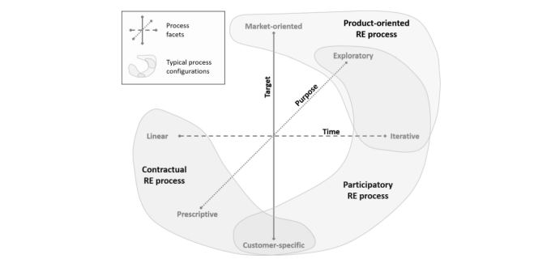

- **Problema:**
    - A nossa metodologia de desenvolvimento de software será ágil, baseado no ciclo de vida **iterativo/incremental** com o processo de desenvolvimento sendo o **Rapid Application Development (RAD)**.  A escolha se deu com base nos critérios apresentados por **GUPTA (2019)** que englobam características dos requisitos, status da equipe de desenvolvimento, envolvimento do usuário, tipo de projeto e risco associado.
    - Em relação ao processo de engenharia de requisitos, **IREB (2022)** apresenta um diagrama que abrange os aspectos do processo de ER. Este diagrama foi a referência para a escolha de um processo de engenharia de requisitos participativo:
    - 

    - O produto será **orientado ao cliente**, apesar de ser uma ferramenta que pode vir a atender necessidades de outros profissionais da saúde, tem-se requisitos muito voltados a necessidade específica do cliente e não está sendo feita uma pesquisa de mercado com intuito de disponibilizar a ferramenta para outros profissionais.
    - O tempo do processo será **iterativo**, visto que os requisitos ainda não são totalmente conhecidos e vão ser evoluídos ao longo do projeto. Além disso, o constante feedback por parte do cliente é de suma importância para adaptarmos os requisitos conforme a necessidade dele.
    - Já o propósito será **exploratório** visto que as partes interessadas terão participação ativa em todo processo e teremos os requisitos em constante evolução.

    - A seguir será listado como cada uma das atividades de ER será realizada com base nas etapas do RAD (conforme visto no diagrama acima):

- **Planejamento de requisitos**

| Atividade | Método | Ferramenta | Entrega |
| :--------: | :--------: | :--------: | :--------: |
|  Elicitação e Descoberta | User Story Mapping | Miro | Backlog dos Requisitos Brutos |
|  Análise e Consenso | Reunião Síncrona do time | Discord | Backlog Validado |
|  Declaração | Criação de issues -> User Story | Github Issues | Todos os requisitos britos validados colocados em issues |

- **User Design**
    - Nessa fase tem-se a criação de protótipos do sistema com base nos requisitos coletados e que posteriormente será apresentado ao cliente para coleta de feedback.

| Atividade | Método | Ferramenta | Entrega |
| :--------: | :--------: | :--------: | :--------: |
|  Representação | Prototipação em Ferramenta de design | Figma | Protótipo de Alta Fidelidade |

- **Construção**
    - Na fase de construção tem-se a implementação do sistema com base no protótipo e história de usuário validado, testes e integração de componentes.

| Atividade | Método | Ferramenta | Entrega |
| :--------: | :--------: | :--------: | :--------: |
|  Verificação e Validação | Pair Programming | VScode | Implementação das histórias de Usuário |

- **Transição**
    - A transição é a fase final do nosso processo e envolve a transição do sistema desenvolvido para a produção, garantindo que ele esteja pronto para uso pelo usuário final, a partir de um teste de aceitação. 

| Atividade | Método | Ferramenta | Entrega |
| :--------: | :--------: | :--------: | :--------: |
|  Organização e atualização | Teste de aceitação pelo cliente | Serviço de hospedagem de sites | Projeto Validado |